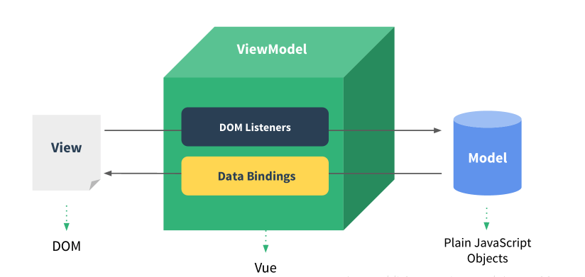

# Vue 初体验

### 原生 JS 写项目的问题

* 语法冗长，复杂，操作页面麻烦，效率低

### JQuery 开发的问题

* 提供了简单的api，简化了操作 dom 的方式
* 但是没有对业务逻辑分层，需要维护数据和 dom 之间的同步

### MVVM

* M: model，数据模型，机器可读性强的数据，也就是前端中的数据，如数组，对象等
* V: view，视图，人眼可读性强的数据，表现为前端中的 dom 对象，如输入框，弹窗等
* VM: 视图模型，将模型和视图进行双向绑定，表现为一些数据监听和数据绑定



### Get Vue

Github: https://github.com/vuejs/vue

英文官网：https://vuejs.org/

中文官网：https://cn.vuejs.org/


# 准备

vue 是一个渐进式的 Web JS 框架，注重开发体验、通用性和性能。但是本质上还是围绕在 `Html`、`CSS`、`JS` 基础上的技术。所以 在学习 vue 之前以及在学习的过程中，都离不开这 "三剑客"。

### HTML + CSS + JS 是基础

* [HTML（超文本标记语言）](https://developer.mozilla.org/zh-CN/docs/Web/HTML)
* [CSS3](https://developer.mozilla.org/zh-CN/docs/Web/CSS)
* [JavaScript 教程](https://www.liaoxuefeng.com/wiki/001434446689867b27157e896e74d51a89c25cc8b43bdb3000) by [廖雪峰](https://www.liaoxuefeng.com)
* [JavaScript 标准参考教程](http://javascript.ruanyifeng.com/) by [阮一峰](http://www.ruanyifeng.com/home.html)

### JS 进阶
vue 单文件组件，也就是基于 `.vue` 文件格式的组件化开发，都是基于 ES6 语法，所以有必要去了解和学习 `ES6` 的特性。

* [ES6](http://es6.ruanyifeng.com/) by [阮一峰](http://www.ruanyifeng.com/home.html)
* [ES6: 快速体验，及实用小贴士](https://github.com/fundon/ES6-QuickStart-and-Tips) by [fundon](https://github.com/fundon)
* [ES6-for-humans](https://github.com/metagrover/ES6-for-humans)

## 环境

本次课程是基于 **MacOS** 上进行的，如果环境是 window 需要先准备好终端环境。

### windows

* [Bash-On-Ubuntu-On-Windows](https://docs.microsoft.com/zh-cn/windows/wsl/about)
* [Bash-On-Ubuntu-On-Windows10](Bash-On-Ubuntu-On-Windows10)
* [git bash](https://gitforwindows.org/)

## 工具

### Git
* [Git教程](https://www.liaoxuefeng.com/wiki/0013739516305929606dd18361248578c67b8067c8c017b000) by [廖雪峰](https://www.liaoxuefeng.com/)

### node(npm)

* [node](https://nodejs.org/zh-cn)
* [nvm: node 版本管理工具](https://github.com/creationix/nvm) (可选)

<!-- ### 个人介绍
### 程康健 & Web Develop

* ID: 程是非sky
* WeChat: 程是非sky
* Blog: www.chengkangjian.com
* Github: https://github.com/chengkj99
* Weibo: https://weibo.com/chengkangjian
* E-mail: chengkj99@foxmail.com

-->

# vue  入门

### vue 是什么？

> Vue (读音 /vjuː/，类似于 view) 是一套用于**构建用户界面**的**渐进式框架**。与其它大型框架不同的是，Vue 被设计为可以自底向上逐层应用。Vue 的核心库只关注视图层，不仅易于上手，还便于与第三方库或既有项目整合。另一方面，当与现代化的工具链以及各种支持类库结合使用时，Vue 也完全能够为复杂的单页应用提供驱动。

1. vue 是一个用于构建用户界面的渐进式框架
    > 我觉得它与其他框架的区别就是渐进式的想法，也就是“Progressive”——这个词在英文中定义是渐进，一步一步，不是说你必须一竿子把所有的东西都用上。 -作者本人在一次分享上对 [渐进式框架](http://www.infoq.com/cn/articles/vue-2-progressive-front-end-solution) 进行了阐述。

1. vue 只关注视图层，可以自低向上逐层应用

    声明式渲染 -> 组件系统 -> 客户管路由 -> 大规模的状态管理 -> 构建工具

    在声明式渲染阶段，甚至都可以像使用 jquery 一样的使用 vue，直接引入`<script src="https://cdn.jsdelivr.net/npm/vue"></script>` 就可以使用。


### 为什么要学习 vue ？

官方文档中有 vue  和其他 框架的对比，[vue 对比其他框架](https://cn.vuejs.org/v2/guide/comparison.html)，总的来说，vue 有下面这些特点，给我们参考是否值得学习：

* 简单，学习曲线低

  它整体思想是拥抱经典的 Web 技术，并在其上进行扩展。

* 组件化开发
* 资源丰富

  [Awesome-vue](https://github.com/vuejs/awesome-vue)

* 轻量、性能

  在 react 和 angular 等框架的对比中，Vue 有更好的性能。[第三方 benchmark](https://cn.vuejs.org/v2/guide/comparison.html)

* 完善的工具链

  vue-cli、vue-router、vuex...


### vue 社区

* [GitHub](https://github.com/vuejs)
* [Twitter](https://twitter.com/vuejs)
* [#vuejs](https://twitter.com/search?src=typd&q=%23vuejs)
* [Forum](https://forum.vuejs.org/)
* [gitter.im](https://gitter.im/vuejs/vue)
* [The-vue-point](https://medium.com/the-vue-point)
* [The-vue-trending](https://github.com/trending/vue)


### 安装和运行

#### 环境

一开始，我们不会涉及到 `打包` 、 `编译` 工具 `webpack`，一切从最简单的地方（Html、CSS、JS）开始。

#### 兼容性

Vue 不支持 IE8 及以下版本，因为 Vue 使用了 IE8 无法模拟的 ECMAScript 5 特性。但它支持所有兼容 ECMAScript 5 的浏览器。

#### 更新日志

最新稳定版本：2.5.16

每个版本的更新日志见 [GitHub](https://github.com/vuejs/vue/releases)。

#### 安装

首先我们需要安装 npm

npm 是 Node.js 的包管理工具，而且 npm 会在 安装 Node.js 的时候顺带装进来，所以我们要安装 [Node.js](https://nodejs.org/zh-cn/)。

使用 Homebrew
  ```
    brew install node
  ```

然后可通过以下方式安装 vue

1. CDN

    可以指定具体的版本号：vue@版本号
    ```
    <script src="https://cdn.jsdelivr.net/npm/vue@2.5.16/dist/vue.js"></script>
    ```

    可供选择的CDN

      - [cdn.jsdelivr.net](https://cdn.jsdelivr.net/npm/vue)
      - [unpkg.com](https://unpkg.com/vue@2.5.16/dist/vue.js)
      - [cdnjs.cloudflare.com](https://cdnjs.cloudflare.com/ajax/libs/vue/2.5.16/vue.js)

1. NPM

    ```
      npm install vue
    ```

1. yarn

    ```
      yarn add vue
    ```

1. [CLI](https://cli.vuejs.org/)

    使用官方提供的脚手架工具 `vue-cli` ，可以帮助我们快速启动一个 vue 工程项目，有多种 [vuejs-templates](https://github.com/vuejs-templates) 工程模板可用 ，开箱即用，快速开发。

    ```
      // 安装 vue-cli
      npm install -g @vue/cli
      # OR
      yarn global add @vue/cli

      // 生成项目
      vue create my-project
    ```
#### 完整版本 和 运行时版本

Vue.js 的运行过程实际上包含两步。第一步，编译器将字符串模板（template）编译为渲染函数（render），称之为编译过程；第二步，运行时实际调用编译的渲染函数，称之为运行过程。

> [不同的版本](https://github.com/vuejs/vue/tree/dev/dist)

  1. 完整版：同时包含编译器和运行时的版本。
  1. 编译器：用来将模板字符串编译成为 JavaScript 渲染函数的代码。
  1. 运行时：用来创建 Vue 实例、渲染并处理虚拟 DOM 等的代码。基本上就是除去编译器的其它一切。

* 独立版本

  包含了编译器，支持 `template` 选项，可以将 `tamplate` 选项编译为 `render` 函数，它也依赖于浏览器的接口的存在，所以你不能使用它来为服务器端渲染。

* 运行时版本

  不包括模板编译，不支持 template 选项。

  可以用 render 选项。
  可以在单文件组件使用，因为单文件组件的模板是在构建时预编译到 render 函数中，运行时构建只有独立构建大小的 30%，只有 16Kb min+gzip 大小。

  NPM 上的 vue 默认指向运行时版本。适合和 `打包` 和 `编译`结合使用，也就是适合于单文件组件开发。[vue package.json](https://github.com/vuejs/vue/blob/dev/package.json#L5)
