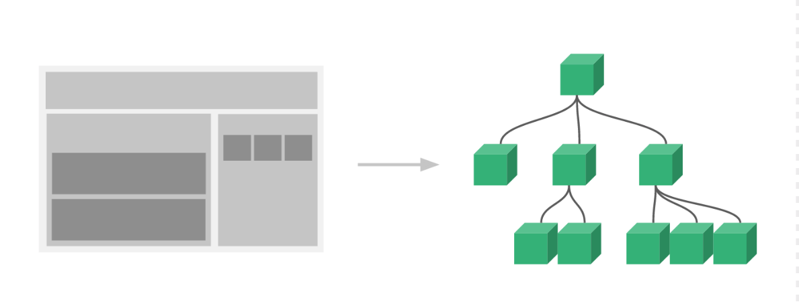

# Vue 快速上手

### 实例1: 渲染声明

渲染声明是 vue 的最核心模块。

vue 基于传统的 HTML 模板语法，将 DOM 绑定到 vue 实例上，然后 vue 在底层的实现上，将 模板编译成虚拟 DOM 渲染函数(render function)。

```
<!DOCTYPE html>
<html lang="en">
<head>
  <meta charset="UTF-8">
  <meta name="viewport" content="width=device-width, initial-scale=1.0">
  <meta http-equiv="X-UA-Compatible" content="ie=edge">
  <title>Document</title>
</head>
<body>
  <div id='app'>

    <!-- Mustache 标签将会被替代为对应数据对象上 msg 属性的值 -->
    {{ message }}

    <!-- 如果只想一次性的插值，不想被数据驱动改变，用 v-once -->
    <div v-once>{{ message }}</div>

    <!-- 也可以渲染模板，用 v-html -->
    <div v-html="messageHtml"></div>

  </div>
</body>
<script src="../utils/vue.js"></script>
<script>
  var app = new Vue({
    el: '#app',
    data: {
      message: 'Hello vue for message!',
      messageForOnce: 'Hello vue for once message',
      messageHtml: '<span style="color: red;"> Hello vue for template render</span>'
    }
  })
</script>
</html>

```

打开浏览器 **Console**，感受 v-once 的不同
```
app.message = 'Hello vue for message, Updated'
app.messageForOnce = 'Hello vue for once, Updated' // 无效
```

### 指令 (Directives)
带有 v- 前缀的 `v-once`、`v-html`、`v-bind`、`v-on`、`v-if`... 称指令。它的作用是当它的值（表达式）改变时，其带来的影响，响应式地作用于 DOM。


### 实例2: 属性绑定

可以将 html 的属性和 数据 进行绑定，动态的更改属性。

```
<!DOCTYPE html>
<html lang="en">
<head>
  <meta charset="UTF-8">
  <meta name="viewport" content="width=device-width, initial-scale=1.0">
  <meta http-equiv="X-UA-Compatible" content="ie=edge">
  <title>Document</title>
</head>
<body>
  <div id='app'>
    <span v-bind:title="title">
      这个 DOM 具有动态的 Title
    </span>
    </img>
  </div>
</body>
<script src="../utils/vue.js"></script>
<script>
  // http://o9h4emdrs.bkt.clouddn.com/atomatom-boom2.gif
  var app2 = new Vue({
    el: '#app',
    data: {
      title: 'title-1',
      imgUrl: 'http://o9h4emdrs.bkt.clouddn.com/live.jpg'
    }
  })
</script>
</html>

```

打开浏览器 **Console**，验证动态的 title
```
app2.message = 'title-2'
app2.imgUrl="http://o9h4emdrs.bkt.clouddn.com/atomatom-boom2.gif"
```

### 指令参数

在指令名称之后以冒号表示的是指令的参数，一些指令能够接收一个“参数”.

比如: `v-bind:title="title"` 和 `v-bind:src="imgUrl"`，这里的 v-bind 指令可以用于响应式地更新 HTML 的特性。


### 实例3: 条件双向绑定

用 条件双向绑定 切换展示不同的 DOM。涉及到的指令有 `v-if`、`v-else`、`v-if-else` 和 `v-show`。

* v-show

  只是简单地切换元素的 CSS 属性 display，DOM 始终会被渲染并被保留，只是隐藏和显示；

* v-if

  是真正的 销毁和重建 DOM，有更大的开销。


```
<!DOCTYPE html>
<html lang="en">
<head>
  <meta charset="UTF-8">
  <meta name="viewport" content="width=device-width, initial-scale=1.0">
  <meta http-equiv="X-UA-Compatible" content="ie=edge">
  <title>Document</title>
</head>
<body>
  <div id='app'>
    <p v-if="isShow">
      Now you can see.
    </p>
  </div>
</body>
<script src="../utils/vue.js"></script>
<script>
  var app3 = new Vue({
    el: '#app',
    data: {
      isShow: true
    }
  })
</script>
</html>
```

打开浏览器 **Console**
```
app3.isShow = false
app3.isShow = true
```

### 实例4：列表渲染 v-for

  可以使用 `v-for` 对列表或对象进行渲染，v-for 指令需要使用 item in items 形式的特殊语法。

```
<!DOCTYPE html>
<html lang="en">
<head>
  <meta charset="UTF-8">
  <meta name="viewport" content="width=device-width, initial-scale=1.0">
  <meta http-equiv="X-UA-Compatible" content="ie=edge">
  <title>Document</title>
</head>
<body>
  <div id='app'>
    <p v-for="(todo, index) in todos">
      <span :key="index">{{ index }}: {{ todo.text }}</span>
    </p>
  </div>
</body>
<script src="../utils/vue.js"></script>
<script>
  var app4 = new Vue({
    el: '#app',
    data: {
      todos: [
        { text: 'Learn Vue' },
        { text: 'Learn Javascript' },
        { text: 'Learn PHP' },
        { text: 'Learn Golang' }
      ]
    }
  })
</script>
</html>
```

打开浏览器 **Console**
```
app4.todos.push({ text: 'Learn Java' })
app4.todos.splice(2, 1)
```


### 实例5: 事件处理 v-on

  可以用 v-on 指令监听 DOM 事件，并在触发时运行一些 JavaScript 代码。

```
<!DOCTYPE html>
<html lang="en">
<head>
  <meta charset="UTF-8">
  <meta name="viewport" content="width=device-width, initial-scale=1.0">
  <meta http-equiv="X-UA-Compatible" content="ie=edge">
  <title>Document</title>
</head>
<body>
  <div id='app'>
    <button v-on:click="getRandomColor">
      换个颜色
    </button>
    {{ value }}
    <div v-bind:style="{background: value, width: '168px', height: '100px', marginTop: '10px'}"></div>
  </div>
</body>
<script src="../utils/vue.js"></script>
<script>
  var app5 = new Vue({
    el: '#app',
    data: {
      value: 'blue'
    },
    methods: {
      getRandomColor() {
        this.value =  '#'+(Math.random() * 0xffffff << 0).toString(16)
      }
    }
  })
</script>
</html>
```

### 实例6: 表单的输入绑定 v-model

  使用 v-model 我们可以在 `<input>` 、`<textarea>`、`<select>` 等元素上创建双向数据绑定。

  v-model 本质上是一个语法糖，在单向数据绑定的基础上，增加了监听用户输入事件并更新数据的功能

#### 修饰符

* .trim: 去掉头和尾的空白字符
* .lazy: input 更新改为 输入更新
* .number: 将用户的输入值转为数值类型


```
<!DOCTYPE html>
<html lang="en">
<head>
  <meta charset="UTF-8">
  <meta name="viewport" content="width=device-width, initial-scale=1.0">
  <meta http-equiv="X-UA-Compatible" content="ie=edge">
  <title>Document</title>
</head>
<body>
  <div id='app'>

    <div>
      <p>输入框</p>
      <input v-model="message" placeholder="edit me">
      <p>Message is: {{ message }}</p>
    </div>

    <div>
      <p>复选框</p>
      <input type="checkbox" id="Jack" value="Jack" v-model="checkedNames">
      <label for="Jack">Jack</label>
      <input type="checkbox" id="john" value="John" v-model="checkedNames">
      <label for="john">John</label>
      <input type="checkbox" id="mike" value="Mike" v-model="checkedNames">
      <label for="mike">Mike</label>
      {{ checkedNames }}
    </div>

    <div>
      <p>选择框</p>
      <select v-model="selected">
        <option v-for="option in options" v-bind:value="option.value">
          {{ option.text }}
        </option>
      </select>
      <span>Selected: {{ selected }}</span>
    </div>

    <!-- 实现一个 v-model， 也是一个没有任何修饰符的 v-model -->
    <input type="text" :value="value" v-on:input="value = $event.target.value">
    Value is: {{ value }}
  </div>
</body>
<script src="../utils/vue.js"></script>
<script>
  var app6 = new Vue({
    el: '#app',
    data: {
      message: '',
      checked: '',
      checkedNames: [],
      selected: '',
      options: [
        { text: 'One', value: 'A' },
        { text: 'Two', value: 'B' },
        { text: 'Three', value: 'C' }
      ],
      value: ''
    }
  })
</script>
</html>

```

### 实例7：计算属性和侦听器

  有时候我们需要对接收的数据进行转化，在模板中太多的逻辑不利于维护，这个时候我们可以使用 计算属性 `computed` 和侦听器 `watch`。

  computed: 不能接收参数，因为是根据依赖侦听的。计算属性会基于它的依赖进行缓存，无副作用。

  methods: 用于接收参数时使用。不会缓存，每次都会重新计算。

  watch: 一种更通用的方式来观察和响应 Vue 实例上的数据变动。用于有副作用的操作，开销大的操作。

  computed 和 watch 区别：从属性名上，computed是计算属性，也就是依赖其它的属性计算所得出最后的值。watch是去监听一个值的变化，然后进行相应的操作。

```
<!DOCTYPE html>
<html lang="en">
<head>
  <meta charset="UTF-8">
  <meta name="viewport" content="width=device-width, initial-scale=1.0">
  <meta http-equiv="X-UA-Compatible" content="ie=edge">
  <title>Document</title>
</head>
<body>
  <div id='app'>
    message:
    <input type="text" v-model="message">
    <br/>
    reversedMessage is: {{ reversedMessage }}
  </div>
</body>
<script src="../utils/vue.js"></script>
<script>
  var app7 = new Vue({
    el: '#app',
    data: {
      message: 'hello'
    },
    computed: {
      reversedMessage() {
        return this.message.split('').reverse().join('')
      }
    },
    watch: {
      message() {
        // do ohter something
      }
    },
    methods: {
      // reversedMessage: function () {
      //   return this.message.split('').reverse().join('')
      // }
    }
  })
</script>
</html>

```

### 缩写

* v-bind 缩写 ：
```
<!-- 完整语法 -->
<a v-bind:href="url">...</a>
<!-- 缩写 -->
<a :href="url">...</a>
```

* v-on 缩写 @

```
<!-- 完整语法 -->
<a v-on:click="doSomething">...</a>
<!-- 缩写 -->
<a @click="doSomething">...</a>
```

### 实例8: vue实例 和 生命周期

  创建 vue 的过程： [vue 的生命周期](https://vuejs.org/v2/guide/instance.html)

  有两个关键的点需要注意：

  * 挂载节点 el
  * template or outerHTML


### 实例9: 组件化开发

#### 什么是组件

  组件，是包含了 HTML、CSS、JavaScript，也就是说包含了组件的模板、样式和交互逻辑等内容，然后暴露出合适的接口。外部只要按照组件设定的属性、函数及事件处理等进行调用即可，完全不用考虑组件的内部实现逻辑，对外部来说，组件是一个完全的黑盒。

  组件和模块的区别：组件强调 `高复用` 和 `低耦合`。模块强调 `高内聚`和 `低耦合`。

#### 组件化开发

  一个大的应用，由若干个组件组合而成。每个组件之间是相互独立的，通过组件接口进行通信。

  最初是通过使用 html、css、js 以页面作为开发单位，当时我们的思维方式就是那样。

  后来我们的前端开发从页面转变为了应用。应用就会有模块封装和切分的需求，很快我们发现应用是可以拆分为组件树的，这是偏展示的一个理解，react的出现揭示了一个事实，就是组件可以是函数，所以后来，vue 也有了 render 函数。

  

  如图所示，想象一下，整个应用是一个大的函数，函数里面可以调用别的函数，每个组件是一个函数，一个组件可以调用别的函数，返回 viture dom，这突破了我们原来对静态页面的理解方式。


#### 定义一个组件

两种方式：

* 通过 Vue.component() 对象来注册,全局注册

 ```
 Vue.component('my-component', { /* ... */ })
 ```

```
  // 通过 Vue.component() 对象来注册,全局注册
  Vue.component('todo-item', {
    props: ['todo'],
    template: '<li>this is a {{ todo }} item.</li>'
  })

  var app9 = new Vue({
    el: '#app',
    data() {
      return {
        todos: [
          { text: 'Learn Vue' },
          { text: 'Learn Javascript' },
          { text: 'Learn PHP' },
          { text: 'Learn Golang' }
        ]
      }
    }
  })
```


* 通过普通JS对象，定义属性的方式来注册，局部注册

```
let MyComponent = { /* ... */ }
```

```
// 通过一个普通的 JavaScript 对象来定义局部组件
  var TodoItem = {
    props: ['todo'],
    template: `<li class="item">this is a {{ todo }} item.</li>`
  }

  var app9 = new Vue({
    el: '#app',
    data() {
      return {
        todos: [
          { text: 'Learn Vue' },
          { text: 'Learn Javascript' },
          { text: 'Learn PHP' },
          { text: 'Learn Golang' }
        ]
      }
    },
    components: {
      'todo-item': TodoItem
    }
  })
```


### 组件通信

* $emit and props


